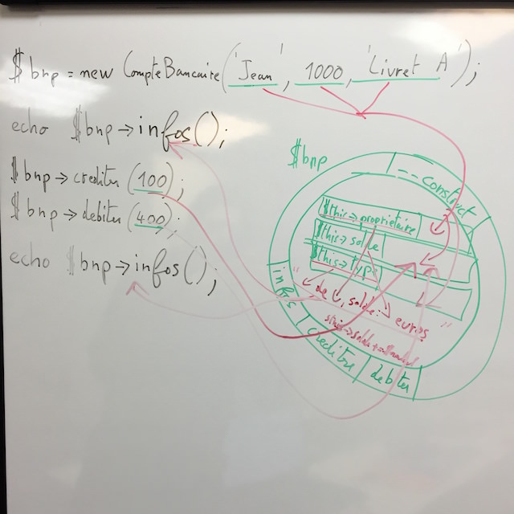

# Formation PHP Objet Prepavenir Décembre 2015

## Git
Un programme qui permet de versionner des fichiers texte, en particulier du code.

### Principales commandes

#### git clone
Permet de cloner un repository git sur une autre machine
Ex : git clone https://github.com/bioub/Formation_PHP_Objet_Prepavenir_2015_12.git

#### git status
Permet de voir quels sont les changements depuis la dernière version

#### git add unFichier
Permet d'ajouter un fichier à la prochaine version
Ex : git add README.md
Ex (permet de tout ajouter) : git add .
Ex (que les fichiers HTML) : git add *.html 

#### git commit -m "Un message"
Permet de créer une nouvelle version (et donc pouvoir revenir à l'avenir à cette version), idéalement il faut "commiter" des choses qui fonctionnent.
Ex : git commit -m "Ajout des principales commandes à la docs"

#### git push
Permet de synchroniser nos 2 repositories
Ex : git push
Ex (avec des noms) : git push origin master

## PHP Objet

### Un objet
Un composant dans un programme qui regroupe des variables (aspect statique) et des fonctions (aspect comportement).

A propos des variables on parle de : 

* attribut,
* propriété,
* ou champ

A propos des fonction on parle de méthodes.

Concrètement on cherche à appliquer des concepts de la vie de tous les jours à la programmation.
Exemple, un ordinateur est un objet qui a des caractérisques (propriétés, ex: marque, modèle), et un comportement (méthodes, ex : démarrer, déplacer le curseur) et un type (classe).

### Une classe
Le type d'un objet et ce qui permet de le créer (construire). On compare souvent les classes à un moule (à gateau), permet de créer des objets qui ont une certaine forme.

Dans un programme on peut avoir une classe (ex : Ordinateur) et plusieurs objets créés en mémoire à partir de cette classe.

Un classe est la déclaration d'un concept (ex: Ordinateur) et l'objet son utilisation.

### Principe d'encapsulation
Les propriétés d'une classe ne doivent être accesibles qu'au travers de méthodes (jamais publiques en général protégées en PHP).

Intérets :

* moins il y de choses à connaitre à propos de la classe, plus elle est simple à utiliser (imaginer des propriétés complexes comme des sockets dans le cas d'une connexion à une base de données)
* permet au développeur qui a créé la classe que les autres développeurs qui vont l'utiliser n'intéragissent que avec vos propriétés de la manière dont vous l'avez prévu (ex : j'aimerai que la marque soit toujours en majuscule, limiter à la lecture...)

