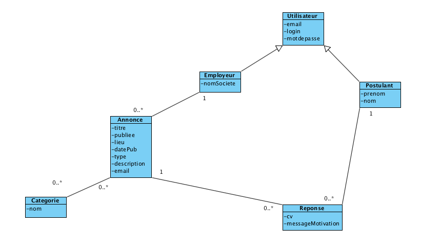

# Exercices Conception Mysql

## Exercice 1

Soit les Entités suivantes :

* Film (id, titre, realisateur)
* Acteur (id, prenom, nom)
* Cinéma (id, ville, nb_salles)
* Séance (id, horaire, salle)

### 1/ Créer les tables sous phpMyAdmin

Créer les 4 tables avec leurs colonnes et trouver les bons types

### 2 / Remplir avec quelques données de test

Ex : 2 ou 3 films, 2 acteurs par films...

### 3/ Trouver les cardinalités entre :

* Film et Acteur
* Séance et Film
* Séance et Cinéma

Et dessiner le schéma entité/association

### 4/ Créer les colonnes et/ou les tables de liens

### 5/ Créer les liens

Ajouter les valeurs dans les nouvelles colonnes ou tables.

##TP Conception SQL : Gestion d’une billetterie

En s’inspirant d’un site type Fnac Spectacles

### 1 / Créer les tables concernant les entités suivantes : Artistes, Spectacles, Lieu, Client, Compte, Commande

### 2 / Ajouter et typer les champs de votre choix (2 ou plus par table) (ex : nom, prénom, dateHeureSpectacle 2013-09-25 16:39:45, etc…)

### 3 / Créer les liens permettant les fonctionnalités suivantes

Fonctionnalités : 

*	CRUD (Create, Read, Update, Delete) Artiste (Chanteur, Humoriste, etc…)
*	CRUD Lieu (Salle, Stade, etc..)
*	CRUD Spectacle (Lien avec Artiste et Lieu)
*	Lister des spectacles par artiste et par lieu
*	Client peut commander des places de spectacles.
*	Client peut créer un compte client.

### 4 / Faire le schéma entité/association

### 5 / Remplir avec des données de test

## TP Création d’un site d’offres d’emploi

L’objectif de ce TP est de créer un site permettant la publication, la visualisation et la réponse à des offres d’emplois. Vous pouvez vous inspirer du site Remix Jobs http://remixjxobs.com/ pour la navigation.

### Cahier des charges

Le site d’offres d’emploi doit contenir à minima les pages suivantes :

#### Accueil du site

La page d’index contient la liste des dernières offres d’emploi publiées.

Chaque offre contient :

*	un titre,
*	le nom d’une société,
*	un lieu,
*	une date de publication,
*	un type (CDI, CDD, Stage ou Freelance).

Il est possible de cliquer sur une offre d’emploi en afficher le détail.

Il est possible de cliquer sur un lien pour aller vers le formulaire d’ajout d’une offre d’emploi.

Optionnel :

*	Une offre d’emploi peut contenir une ou plusieurs catégories (ex : PHP, Java, HTML, CSS…)
*	Formulaire de login

#### Détail d’une offre d’emploi

La page qui affiche le détail d’une offre d’emploi contient :

*	un titre,
*	le nom d’une société,
*	un lieu, 
*	une date de publication, 
*	un type (CDI, CDD, Stage ou Freelance),
*	la description de l’offre d’emploi

Cette page contient également le formulaire qui permet de répondre à l’offre d’emploi, ce formulaire contient les champs suivants :

* prénom,
*	nom,
*	email,
*	cv à uploader au format Word, PDF ou ODT
*	message de motivation

Lorsque ce formulaire est validé, le postulant est redirigé vers la page d’accueil sur laquelle un message s’affiche indiquant que sa demande a bien été prise en compte.

La page contient le lien pour revenir à la liste des offres d’emploi ainsi que le lien vers le formulaire d’ajout.

Optionnel :

*	Une offre d’emploi peut contenir une ou plusieurs catégories (ex : PHP, Java, HTML, CSS…)
*	Formulaire de login
*	Si l’utilisateur est identifié il n’a plus à saisir son prénom, nom et email
*	Validation de formulaire (champs prenom, nom, email, cv obligatoires, CV de type PDF, Word ou ODT et ne dépassant pas 1Mo, email au format valide)

#### Formulaire d’ajout d’une annonce

Cette page contient un formulaire permettant de saisir une nouvelle annonce qui doit contenir les champs suivants : 

*	un titre,
*	le nom d’une société
*	un lieu
*	un type (CDI, CDD, Stage ou Freelance),
*	une description

Lorsque ce formulaire est validé, l’employeur est redirigé vers la page d’accueil sur laquelle un message s’affiche indiquant que son annonce a bien été créée.

Optionnel :

*	Permettre à l’employeur de s’identifier, le nom de la société n’est alors plus à saisir.
*	Permettre l’ajout de catégorie (en JavaScript ?)
*	Validation de formulaire (les champs titre, société, lieu et type sont obligatoire, au moins une catégorie)

#### Pages optionnelles (obligatoire pour la conception de base de données) :

*	Afficher les annonces d’un certain type (rendre le type cliquable sur les autres pages)
*	Afficher les annonces par lieu (rendre les lieux cliquables sur les autres pages)
*	Recherche par mots-clés (un formulaire de recherche par mots-clés, la requête SQL sera sous la forme "SELECT * FROM annonce WHERE titre LIKE '%symfony%' OR description LIKE '%symfony%'")
*	Modifier/supprimer une annonce
*	Inscription d’un employeur
*	Inscription d’un postulant
*	Partie admin, permettant à l’employeur de consulter les réponses à ses offres d’emploi

### Correction :

#### Dictionnaire de données

Réponse E
Publiées C
Titre C
nom d’une société, C
lieu C
date de publication C
type C
CDI V
CDD V
Stage V
Freelance V
Catégories E
PHP V
Java V
HTML V
CSS V
Login C
Description C
Prénom C
Nom C
Email C
Cv C
Message C
Postulant E
l’utilisateur E
annonce E
l’employeur E


#### Schema Entité Association


